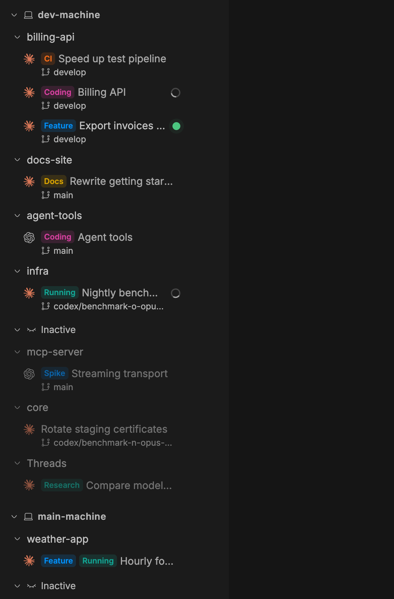

# Machine Sidebar for bb

A thread list for [bb](https://github.com/get-bb/bb) that groups threads by the
**machine they run on**, then by **project**. Useful when you work across
several machines, for example a laptop and a remote Mac or Linux box.



## Features

- **Machine → project → thread.** A thread is grouped under the machine its
  environment runs on. A project with threads on two machines appears under
  both, each with only that machine's threads. Threads without a project
  appear as "Threads" under their machine.
- **Title tags.** Start a title with `[Tag]`, e.g. `[Coding][Running] Weatherloop`,
  and each tag is drawn as a colored pill. Pick colors per tag under
  Settings → Installed plugins → Machine Sidebar → Title tags; other tags get a
  stable automatic color. Changes show up in every open window right away.
- **Inactive.** Mark a thread or a whole project inactive from its **…** menu.
  It moves into its machine's **Inactive** group at the bottom, collapsed and
  dimmed. It comes back by itself when it waits for your input or a new turn
  finishes or fails; opening or reading it does not wake it.
- **Branch and status.** Each row shows the git branch under the title and a
  status dot: amber waits for you, red failed, green finished and unread, a
  spinner means the agent is working. Collapsed groups show the most urgent
  dot they contain.
- **Quick actions.** Hover a project for **+** (new thread in that project on
  that machine). Hover a thread for **Archive** and **…** (open in split,
  rename, pin, mark read/unread, mark inactive, delete).
- Pinned threads sit on top; child threads are indented under their parent.
  bb's `Cmd+1…9` and next/previous-thread shortcuts keep working.

Tag colors and inactive marks are stored on the bb server, so every window and
machine sees the same state. Collapsed groups are remembered per window.

## Install

From the bb plugin marketplace, or:

```sh
bb plugin install git:https://github.com/regenrek/bb-plugin-machine-sidebar.git
```

bb switches to the new list automatically. To switch back, choose another list
under Settings → Appearance → Sidebar, or run `bb plugin disable machine-sidebar`.

Requires bb 0.44 or later.

## Development

```sh
npm install
npx tsc -p .                              # type check
node --test tree.test.ts tags.test.ts     # unit tests
bb plugin build                           # build dist/
bb plugin install . --yes                 # install from this folder
bb plugin dev                             # rebuild and reload on save
```

| File | Purpose |
| --- | --- |
| `app.tsx` | Thread list UI |
| `tree.ts` | Grouping, nesting, inactive rules |
| `tags.ts` | Title tag parsing, colors, rule cleanup |
| `tag-rules.tsx`, `inactive.tsx` | Loading and live refresh of tag rules and inactive marks |
| `settings.tsx` | Title tags settings page |
| `server.ts` | Storage and RPC for tag rules and inactive marks |

## License

MIT
